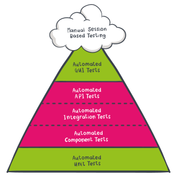

# ReassureTest
<!--start-->
[]()
[]()
[]()<!--end-->
[](http://nuget.org/packages/ReassureTest)
[](http://nuget.org/packages/ReassureTest)
[](http://nuget.org/packages/ReassureTest)
[](http://www.apache.org/licenses/LICENSE-2.0)

*Making tests and testing fun, fast and easy...*

<br>

<table>
    <tr>
        <td align="center" valign="center">
            
            <br><b>Intention revealing tests</b>
            <br><i>Fuzzy matching rules combined with a simple assert language makes your tests smaller and concise.</i></td>
        <td align="center" valign="center">
            
            <br><b>Faster to write</b>
            <br><i>Asserts are expressed with much less typing, and you can have ReassureTest do most of the typing for you!</i></td>
    </tr>
    <tr>
        <td align="center" valign="center">
             
            <br><b>Simpler to maintain</b>
            <br><i>ReasureTest automatically detects changes in your code base (e.g. new fields) and generates new asserts for you.</i></td>
        <td align="center" valign="center">
             
            <br><b>Highly configurable</b>
            <br><i>We provide enough flexibility to cater for your needs to make complex types simple to represent and assert.</i></td>
    </tr>
    <tr>
        <td align="center" valign="center">
            
            <br><b>Asserts as specifications</b>
            <br><i>Assert are easier to share, discuss and edit with non-technical people, and enable testers to write the expected values themselves.</i></td>
        <td align="center" valign="center">
             
            <br><b>Free & Open source</b>
            <br><i>Respects your freedom to run it, to study and change it, and to redistribute copies with or without changes.</i></td>
    </tr>
</table>

<br>
<br>

**Why use ReassureTest**

The main problems with traditional unit tests that we seek to eliminate are are

1. Writing tests is a laborious and boring task.
2. Asserts expressed as code yields poor readability full of noise.
3. Code and test easily gets out of sync.
4. Tests are detrimental to change.
5. Tests have poor convincibility of coverage.

These points are further elaborated at https://github.com/kbilsted/StatePrinter/blob/master/doc/TheProblemsWithTraditionalUnitTesting.md (will be ported to this repo...).


We achieve these goals by using a novel new way of specifying asserts. Expected values are expressed using a domain specific language. And upon a mismatch, ReassureTest prints the actual values **effectively doing 99% of the assert-typing work for you, and making it a breeze to learn.** 


<br>

**Compatibility**

<table>
    <tr>
        <th>Supported testing framework</th>
        <th>Supported .Net version</th>
    </tr>
    <tr>
        <td>
            <ul>
                <li> Nunit ✔️ 
                <li> Xunit ✔️
                <li> MS Test ✔️
                <li> ... any other testing framework ✔️
            </ul>
        </td>
        <td>
            <ul>
                <li> .Net framework 4.5 ✔️ 
                <li> .Net standard 2.0 ✔️ 
                <li> .Net Core 3.1 ✔️ 
            </ul>
        </td>
    </tr>
</table>

<br/>
<br/>

# 1. Getting started 

Install the nuget package `ReassureTest` from nuget: `dotnet add package ReassureTest`

You can use ReasureTest for any automated test. But typically when you move from unit testing to api tests, integration tests or component tests, the actual data we test on become larger and more complex. So you can argue that the diagram om "the testing pyramid" show the main focus of ReassureTest. 



Check out these good references advocating moving up the "test pyramid" is beneficial:

* "Why Most Unit Testing is Waste" by James O Coplien https://rbcs-us.com/documents/Why-Most-Unit-Testing-is-Waste.pdf 
* "Unit Testing is Overrated" by Alexey Golub  https://tyrrrz.me/blog/unit-testing-is-overrated

This project is an evolution of StatePrinter (https://github.com/kbilsted/StatePrinter/) so many of the concepts are originating from there.


<br/>
<br/>

# 2. An example workflow

In this example we use Nunit for setting up and executing tests but **ReassureTest works with any testing framework**.

Asserts are expressed using an `Is()` method. Let's put it to action for testing a shopping basket. 

```csharp
[Test]
public void When_ordering_rubber_ducs_Then_get_a_discount()
{
    var basket = new shoppingBasket();
    basket.LatestDeliveryDate = new DateTime(2020, 02, 01);
    basket.Add(3, "Rubber duck special");
    var order = basket.Checkout();

    order.Is(@"");
}
```

Line 7 states the order is "nothing": (`order.Is(@"")`). Clearly this is incorrect! But worry not, we want the framework to do some heavy lifting for us. When running the test case, it fails with the message

```
Expected: ""
But was:  "{ Id = ..."
Actual is:
{ 
    Id = guid-0
    OrderDate = now
    LatestDeliveryDate = 2020-02-01T00:00:00
    TotalPrice = 26.98
    OrderLines = [
        {
            Id = guid-1
            Count = 3
            OrderId = guid-0
            Name = `Rubber duck special`
            SKU = `RD17930827`
            Amount = 9.99
        },
        {
            Id = guid-2
            Count = 1
            OrderId = guid-0
            Name = `Sale 10%`
            SKU = null
            Amount = 6.183
        }
    ]
}
```

We can now copy-paste this into our test

```csharp
[Test]
public void When_ordering_rubber_ducs_Then_get_a_discount()
{
    var basket = new shoppingBasket();
    basket.LatestDeliveryDate = new DateTime(2020, 02, 01);
    basket.Add(3, "Rubber duck special");
    var order = basket.Checkout();

    order.Is(@" {
        Id = guid-0
        OrderDate = now
        LatestDeliveryDate = 2020-02-01T00:00:00
        TotalPrice = 26.98
        OrderLines = [
            {
                Id = guid-1
                Count = 3
                OrderId = guid-0
                Name = `Rubber duck special`
                SKU = `RD17930827`
                Amount = 9.99
            },
            {
                Id = guid-2
                Count = 1
                OrderId = guid-0
                Name = `Sale 10%`
                SKU = null
                Amount = 6.183
            }
        ]
  }");
}
```

Done! We typed only the test-setup (the short part of a test). The lenghty part is autogenerated.


<br/>
<br/>

### 2.1. A closer look at the assert

Let's take a closer look at what exactly has been generated.

We see a *specification* has been generated, focusing on fields and their values. The language has been designed to be free of noise that inevitably follow with writing asserts as code or when using JSON as specifications. 

The specification is essentially a bunch of asserts, e.g. we check the `TotalPrice` is correct, that a discount order row has been added etc.

ReassureTest uses configurable *fuzzy matching* to make asserts easier to read, write and maintain.

* `Id = guid-0`, `Id = guid-1`, ... refer to actual guid values. Typically, what we think important about guid is that e.g. orderlines order id is the actual id of the order - but we care less about the value. 
* `OrderDate = now` refer to the current clock rather than a set date. All date comparisons has an allowed slack, meaning that if the orderdate is slightly the value of "now" we allow `now` to be the expected value. 
* Strings are surrounded by <code>&#96;&#96;</code> rather than `""`. This is quite deliberate, as it becomes easy tto copy-paste the output of ReasureTest into a C# string without the need for escape charaters. Ultimately, making it much easier to deal with.
* The ordering of fields are not important you can specify in the order you want, as long as all fields are covered and the values are as the actual value

i.e. the specification
```
{
    A = 1
    B = 2
}
```   

is equivalent to

```
{
    B = 2
    A = 1
}
```   


<br/>
<br/>

# 3. Fuzzy matching rules

It is often very convenient to assert values non-strictly. We call this *"fuzzy matching"*, and it enables us to write asserts that are "good enough" to be valuable while at the same time making the testing much easier. Either since we can require less than complete control over all dependences or because the asserts are easier to express. 

This is particular useful when you "move up the unit test pyramid". 

Here we explain what ReassureTest's language support in terms of fuzzy matching.


### Any value
* `?`: `null` or any value
* `*`: any non-null value

e.g. `SKU = *` means that we want the SKU to have any non-null value. It can also be used on complex values such as `OrderLines = *`.


### Array elements
* ``**``: zero or more elements (not implemented yet)
* `*`: any element 

e.g.  `OrderLines = [ *, * ]` means that there are two order lines objects, both not null. 


### Dates
* `today`: Today's date' (not implemented yet)
* `now`: DateTime now
* Dates are equal when difference is less than date slack


### Decimal, float, double
* `decimal`, `double`, `float` are equal when difference is less than decimal slack (not implemented yet)


### Strings
The string `"some text"` is matched by all of the following: 
* <code>&#96;some text&#96;</code> 
* `*`: zero or more characters
  * <code>&#96;*&#96;</code> 
  * <code>&#96;some *&#96;</code> 
  * <code>&#96;* text&#96;</code>
  * <code>&#96;*me te*&#96;</code>
* Newlines characters `\n` and `\r` can be unified or completely ignored (not implemented yet)


### Guids
* `guid-x` represents a unique guid value, without specifying the exact value. This is used for ensuring two or more guids are the same or different.


### Enums
* `?`: `null` or any value
* `*`: any non-null value


### Exceptions
* Exceptions are transformed into a simple form, a class containing `Message` and `Type`. A `Data` field is added only when it contains elements.

```csharp
var ex = new Exception("message") { Data = {{"a", "b"}} };

ex.Is(@"{
    Message = `message`
    Data = [
        {
            Key = `a`
            Value = `b`
        }
    ]
    Type = `System.Exception`
}");
```


<br/>
<br/>

# 4. The specification language

We use a *Specification Language* for expressing asserts. It is a domain specific language targeted test scenarios. It understands fields and their values. It has been designed to be free of the noise that inevitably follow with writing asserts as code. There is no requirement on using new lines or `;` to separate asserts. Field names are not enclosed in `""`. Everything is as smooth as possible.

Hence these two specifications are identical:

```csharp
sut.Is("{ a = 1 b = false }");
// is simiar to
sut.Is(@" {
        b = false
        a = 1
    }");
```

Essentially, the language has the notion of two types of values, *simple values* and *complex values*. 
  * Simple values are numbers, bools, strings etc. 
  * Complex values can either be arrays or objects, both of which holds simple or complex values. 

A more precise (and readable) way to explain the language is by use of the extended Backus–Naur form. If you are not familiar with EBNF, then it's definitely a rabbit-hole worth digging into. For example starting with https://tomassetti.me/ebnf/':

```ebnf
Value    = Simple | Complex
Simple   = number | bool | guid | string | date | wildcard | enum
Complex  = Array | Object
Array    = "[" Value* "]"
Object   = "{" (Name "=" Value)* "}"
Name     = char (char | digit)*
                
number   = ["+"|"-"] digit* "." digit*
bool     = "true" | "false"
guid     = char{8} "-" char{4} "-" char{4} "-" char{4} "-" char{8}
string   = "`" char* "`"
date     = digit{4} "-" digit{2} - digit{2} "T" digit{2} ":" digit{2} ":" digit{2}
wildcard = "*" | "?" | "now"
enum     = char (char | digit)*
digit    = 0..9
char     = "a..Z_"
```

What is not evident from neither the explanation nor the grammer, is the slack that is used when comparing the actual and expected values. The slack values are configured through the `Configuration` class. See `Reassure.DefaultConfiguration`.


<br/>
<br/>

# 5. Simple field filtering

Often when comparing object-graphs, you want to ignore fields uninteresting to the test. As an alternative to using the wildcards `*` and `?`, you can filter away any fields. A simple filtering mechanism exists based on the predicate *PropertyInfo -> bool*. 

**Filter away every field not starting with `"S"`**

```csharp
wiggles.Woggle()
    .Without(pi => !pi.Name.StartsWith("S"))
    .Is("{ S2 = `s2s2s2` }");
```

**Use multiple filters**

```csharp
new ThreeStrings() { S1 = "world", S2 = "hello", S3 = "foobar" }
    .Without(pi => pi.Name == "S1")
    .Without(pi => pi.Name == "S3")
    .Is("{ S2 = `hello` }");
```


**Filter away fields of type `AuditingInfo`**

```csharp
order
    .Without(pi => pi.PropertyType == typeof(AuditingInfo))
    .Is("{ ... }");
```


More elaborate filtering is also possible, see below.


<br/>
<br/>

# 6. Data projection

To simplify the output of an object graph, it is possible to change the value or fields - or even filtering them away. For example, for most tests, reassuring *auditing* fields may be more of a hinderance than providing value.

## 6.1 Simplify rich domain models

Using rich domain models is a common implementation strategy that improves readability and maintainability. Simple types are replaced with classes. This yields both a closer relationship between model and implementation, and the domain types establishes a conceptual foundation making it easier to extend and adapt the application for future changes. It is a very interesting effect when the process of transitioning to a rich domain model feeds new "emergent behaviour". You can read more about it at http://firstclassthoughts.co.uk/Articles/Design/DomainTypeAndEmergentBehaviour.html The opposite of using a rich domain model is sometimes refered to as "primitive obsession", and is explained from that angle e.g. in https://lostechies.com/jimmybogard/2007/12/03/dealing-with-primitive-obsession/ and https://medium.com/the-sixt-india-blog/primitive-obsession-code-smell-that-hurt-people-the-most-5cbdd70496e9

Assume we want to ensure we do not intermix the order date and the max. delivery date, we can do this on the type level using

```csharp
class OrderDate {
    public DateTime Value { get; set; }
}

class LatestDeliveryDate {
    public DateTime Value { get; set; }
}

class Order {
    public OrderDate OrderDate { get; set; }
    public LatestDeliveryDate LatestDeliveryDate { get; set; }
    public string Note { get; set; }
}
```

This produces the following assert

```csharp
var order = new Order() 
{ 
    OrderDate = new OrderDate() { Value = DateTime.Now } 
    ...

order.Is(@"{
    OrderDate = {
        Value = now
    }
    LatestDeliveryDate = {
        Value = 2021-03-04T00:00:00
    }
    Note = `Leave at front door`
}");"
```

Unfortunately, this is too verbose for my liking - it unnecesarrily hurt readability. We remedy this by using **FieldValueTranslators**, that is functions that map representation. Let's configure two such that when traversing the `order` object, we use their internal date representation.


```csharp
order   
    .With(cfg => cfg.Harvesting.Add((parent, value, pi) => Flow.Use(value is OrderDate d ? d?.Value : value)))
    .With(cfg => cfg.Harvesting.Add((parent, value, pi) => Flow.Use(value is LatestDeliveryDate d ? d?.Value : value)))
    .Is(@"{
    OrderDate = now
    LatestDeliveryDate = 2021-03-04T00:00:00
    Note = `Leave at front door`
}");"
```

Note: You can do any kind of transformationm but be careful with not overcomplicating stuff. For example this configuration does the same as above but looks much more complex

```csharp
// too complex
var cfg = Reassure.DefaultConfiguration.DeepClone();
cfg.Harvesting.Add((parent, field, pi) =>
    field switch
    {
        OrderDate od => Flow.Use(od.Value),
        LatestDeliveryDate ldd => Flow.Use(ldd?.Value),
        _ => Flow.Use(field)
    });
```


<br/>

## 6.2. Advanced field filtering

We support filtering of fields. There are a number of ways you can filter away field. For example, based on the name of the field, the type of the field - or even its value!

To do this you simply add instances of `Func<object, object, PropertyInfo, Flow>`, that is a function taking a parent value, a field value (the field is a field of "parent"), information about the field (the `PropertyInfo`) and returns a `Flow`.


**Filtering only string fields holding value `hello`**

```csharp
 new ThreeStrings() { S1 = "world", S2 = "hello", S3 = "foobar" }
    .With((parent, field, pi) => pi.PropertyType == typeof(string) && field.Equals("hello") ? Flow.Use(field) : Flow.Skip)
    .Is("{ S2 = `hello` }");
```


<br/>
<br/>

# 7. Configuration
There are two ways you can configure ReassureTest

1. Use the global settings part of the api.
2. Use a configuration with `With()`.

The first you use to change the overall characteristics of your usage, while the second is often to fit specific corner cases.

The default configuration can be changed by `Reassure.DefaultConfiguration`.

If you need a new copy of the default configuration you can use `var newCfg = Reassure.DefaultConfiguration.DeepClone()`.


## 7.1. Nunit example changing the default configuration 

For Nunit you can optionally setup a global setting using

```csharp
[SetUpFixture]
public class TestsSetup
{
    [OneTimeSetUp]
    public void Setup()
    {
        Reassure.DefaultConfiguration.Outputting.EnableDebugPrint = false;
        Reassure.DefaultConfiguration.TestFrameworkIntegration.RemapException = ex => new AssertionException(ex.Message, ex);
    }
}
```

## 7.2 Nunit example, changing the configuration for a test

Either setup a configuration object with `DeepClone()` or re-use an existing configuration variable. Then call `.With(cfg).Is()` to use the configuration settings.

```csharp
[Test]
public void Example()
{
    var cfg = Reassure.DefaultConfiguration.DeepClone();
    cfg.Harvesting.FieldValueTranslators.Add( ... );

    CreateOrder().With(cfg).Is( ...);
}
```


<br/>
<br/>

# 8. Comparison with traditional asserts

To put things into perspective, here is a side-by-side comparison with a traditional Nunit test using `Assert.AreEqual()`.

*There are actually two errors in the below listing, can you spot them? Not easy, right!*
<table>
<tr>
<td valign="top">

```csharp
var slack = TimeSpan.FromSeconds(2);
Assert.IsNotNull(order);
Assert.AreNotEqual(order.Id, Guid.Empty);
Assert.IsTrue((order.OrderDate-DateTime.Now).Duration() <= slack);
Assert.AreEqual(order.LatestDeliveryDate, basket.LatestDeliveryDate);
Assert.AreEqual(order.TotalPrice, 26.98M);
Assert.AreEqual(order.OrderLines.Count, 2);
Assert.AreNotEqual(order.OrderLines[0].Id, order.Id);
Assert.AreEqual(order.OrderLines[0].Count, 3);
Assert.AreEqual(order.OrderLines[0].OrderId, order.Id);
Assert.AreEqual(order.OrderLines[0].Name, "Rubber duck special");
Assert.AreEqual(order.OrderLines[0].SKU, "RD17930827");
Assert.AreEqual(order.OrderLines[0].Amount, 9.99);
Assert.AreNotEqual(order.OrderLines[1].Id, order.Id);
Assert.AreEqual(order.OrderLines[1].OrderId, order.Id);
Assert.AreEqual(order.OrderLines[1].Name, "Sale 10%");
Assert.AreEqual(order.OrderLines[1].SKU, null);
Assert.AreEqual(order.OrderLines[1].Amount, 2.997);
```
</td>
<td valign="top">

```csharp
order.Is(@" {
    Id = guid-0
    OrderDate = now
    LatestDeliveryDate = 2020-02-01T00:00:00
    TotalPrice = 26.98
    OrderLines = [
        {
            Id = guid-1
            Count = 3
            OrderId = guid-0
            Name = `Rubber duck special`
            SKU = `RD17930827`
            Amount = 9.99
        },
        {
            Id = guid-2
            Count = 1
            OrderId = guid-0
            Name = `Sale 10%`
            SKU = null
            Amount = 6.183
        }
    ]
}");
```
</td>
</tr>
    <tr>
        <td>Roughly 970 characters typed</td>
        <td>0 charecters typed (autogenerated)</td>
    </tr>
    <tr>
        <td>When the code changes: Manual task to identify need and update the test</td>
        <td>Automatically updated</td>
    </tr>
    <tr>
        <td>Are all fields covered: Manual task to identify</td>
        <td>Automatic</td>
    </tr>
    <tr>
        <td>Asserts as code, difficult to share and edit for non-programmers</td>
        <td>Asserts are expressed in a light-weight understandable format</td>
    </tr>
    <tr>
        <td>Roughly 50% of the asserts is "noise" (e.g. words "Assert.AreEqual"</td>
        <td>Asserts are expressed as a specification</td>
    </tr>
</table>


<br/>
<br/>

# 9. Why not serialize to JSON and compare strings?

In some ways ReassureTest is similar to json-serializing an object graph and doing a string-assert. In Many ways it is not the same though.

JSON strings look awful in C# code since multiline strings escape `"` as `""`. It make test feel all wrong. 

JSON is tedius to hand-edit. The format is mercyles and complains if you forget a `,` or have leave in a trailing comma!

JSON does not allow you to do wildcard or other fuzzy matching.

<br>
<br>
<br>
Have fun
<br>
 -Kasper B. Graversen
